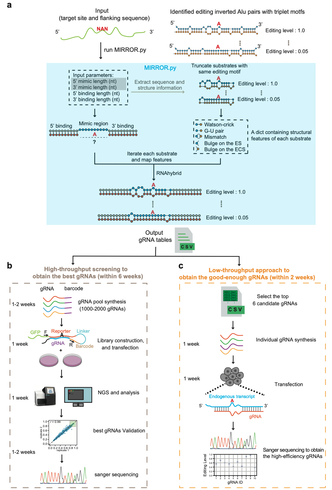

# MIRROR

Workflow of the **MIRROR (Mimicking Inverted Repeats to Recruit ADAR via Engineered Oligoribonucleotide)**.

## Python packages and softwares

The script was tested on a centos machine (CentOS Linux release 7.8.2003).

|        python version        | 3.8   |
| :--------------------------: | ----- |
|            pandas            | 1.5.1 |
|          Biopython           | 1.79  |
| RNA python apis of ViennaRNA | 4.0.2 |
|          RNAhybrid           | 2.1.2 |

## Usage

The main script, **MIRROR.py**, generates gRNAs with various structural features extracted from the highly edited natural ADAR substrates. The **substrates** directory contains the identified inverted Alu pairs used for gRNA generation.

To view help information, run *python MIRROR.py -h*. Before running the script, ensure the necessary packages and software are installed, and update the RNAhybrid path in the script to point to your own RNAhybrid installation.

The output includes a CSV file containing all generated gRNAs and basic information, and a log file showing structural information predcited by RNAhybrid. You can use *less -S* to view it on a linux machine.

 

