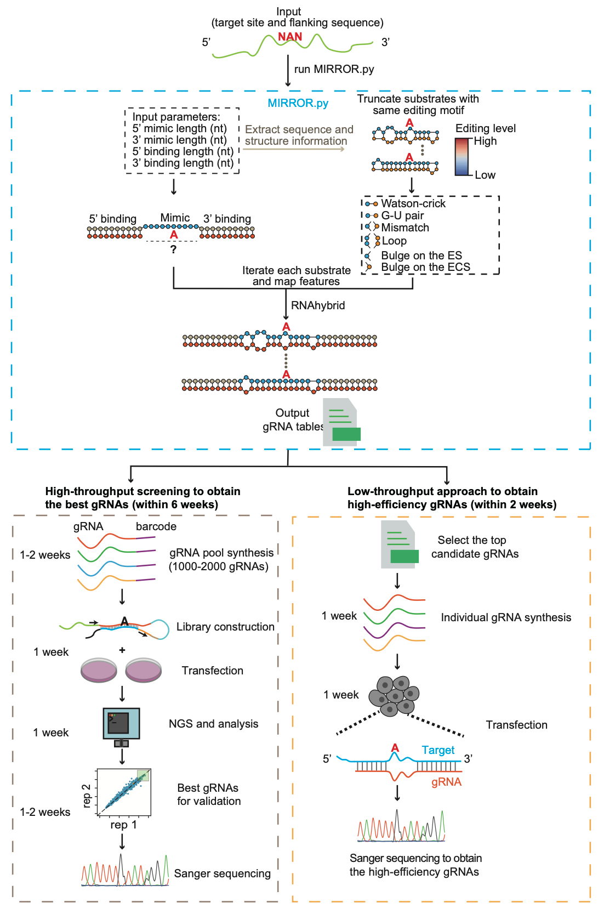

# MIRROR

Workflow of the **MIRROR (Mimicking Inverted Repeats to Recruit ADAR via Engineered Oligoribonucleotide)**.



## Python packages and software

The script was tested on a centos machine (CentOS Linux release 7.8.2003).

| python version               | 3.8    |
| :--------------------------- | ------ |
| pandas                       | 1.5.1  |
| Biopython                    | 1.79   |
| RNA python APIs of ViennaRNA | 4.0.2  |
| RNAhybrid                    | 2.1.2  |
| pysam                        | 0.21.0 |

## Usage

The main script, **MIRROR.py**, generates gRNAs with various structural features learned from the highly edited natural ADAR substrates. The **substrates** directory contains the inverted Alu pairs used for gRNA generation.

To view help information, run *python MIRROR.py -h*. Before running the script, ensure the necessary packages and software are installed, and update the RNAhybrid path in the script to point to your own RNAhybrid installation.

The output includes a CSV file containing all generated gRNAs and basic information, and a log file showing structural information predicted by RNAhybrid. You can use less -S to view it on a linux machine.

## Command examples

1. gRNA generation for high-throughput screening:

   ```shell
   python3.8 ./MIRROR_v1.py -t GAPDH_1208_TAG.fa -l 51 -fm 3 -tm 25 -fa 4 -ta 4 -o GAPDH_1208_TAG -p 36 -n 2000
   ```

2. gRNA generation for for low-throughput testing:

   ```shell
   python3.8 ./MIRROR_v1.py -t GAPDH_1208_TAG.fa -l 51 -fm 3 -tm 25 -fa 4 -ta 4 -L -o GAPDH_1208_TAG_test_final -p 36 -n 2000
   ```

3. editing level analysis based on targeted-RNA-seq:

   ```shell
   python pileup_editing_analysis_v2.py -b ./5L2_E2E_STAR.Aligned.out.sorted.bam -f ./UAA_pool_reference.fa  -o ./output/ -F 10 -p 124
   ```
## License
This software is licensed under the GNU General Public License (GPL). However, it is free for non-commercial use only. Commercial use is prohibited without prior written permission from the authors.
